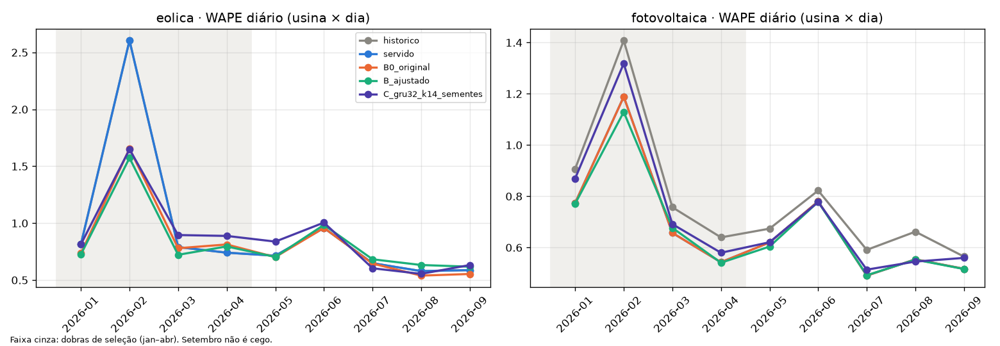
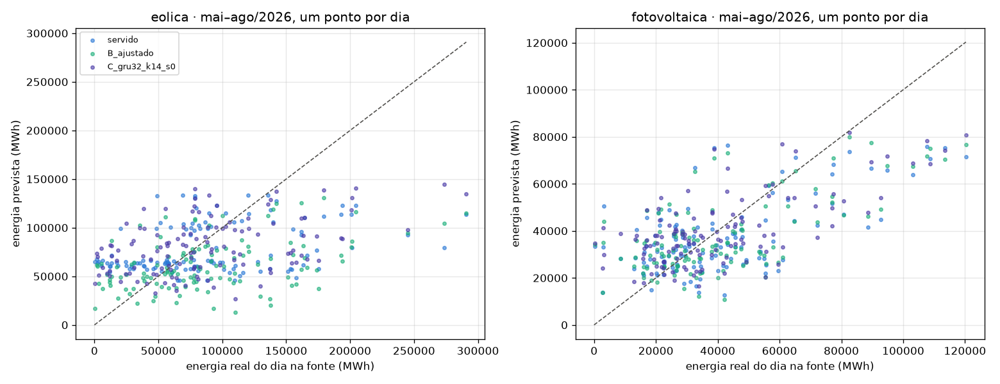
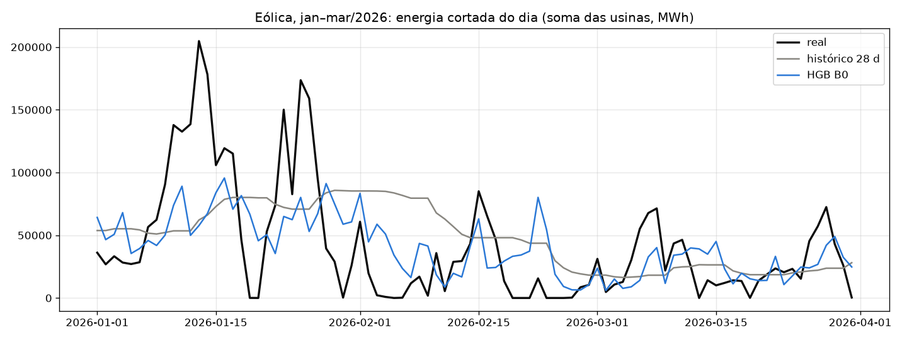

# Experimento controlado: histórico × HGB ajustado × rede temporal (GRU)

Executado em 26/09/2026 na branch `codex/experimento-rede-temporal`, criada de `origin/main`
(`7ee94f4`) num worktree separado. Nada do produto foi alterado: o modelo servido, a função de
limiar e os limiares salvos continuam os mesmos. O protocolo foi pré-registrado em
[`protocolo.md`](protocolo.md) antes de qualquer resultado, e sua única emenda (sobre volume
divergente) veio antes de qualquer número de mai–ago.

## Resumo

| Pergunta | Resposta medida |
|---|---|
| A rede temporal melhora o volume eólico? | **Não.** Em mai–ago, a GRU teve WAPE diário médio de 0,750 (média de 3 sementes), contra 0,725 da composição servida. Venceu 2 de 4 meses (julho e agosto) e perdeu maio por larga margem. Em setembro: 0,632 contra 0,587. |
| Os ajustes no HGB melhoram o volume eólico? | **Não.** O HGB ajustado (B2, treino de 180 dias) teve 0,751 contra 0,725, vencendo 1 de 4 meses, e um viés de −29% na energia. |
| Algo supera a composição servida no volume eólico? | **O próprio HGB original (B0)**, que hoje só é usado quando falta histórico: 0,711 contra 0,725 em mai–ago (3 de 4 meses) e 0,554 contra 0,587 em setembro. O ganho é pequeno (≈2% relativo em mai–ago e ≈6% em setembro). |
| A correção do limiar muda os alertas? | **Praticamente não.** A função corrigida escolhe o mesmo limiar da original nas duas fontes. Só o arredondamento para 4 casas muda de 3 a 22 alertas em ~540 mil linhas. É uma correção de robustez, não de desempenho. |
| O que explica fevereiro? | Uma queda brusca e geral do corte eólico no início do mês (502 GWh contra 2,45 TWh em janeiro, −80%), que a média de 28 dias levou semanas para absorver. O erro está espalhado entre as usinas (as 10 piores somam 24% dele). Cobertura e dados antigos não explicam o erro. |
| Recomendação | Manter a rede fora do produto; não adotar as variantes do HGB; avaliar a troca do volume eólico servido do histórico para o HGB B0, que o responsável deve confirmar; adotar a função de limiar corrigida por robustez. Detalhes na seção 9. |

Nenhum número abaixo é "porcentagem de acerto". WAPE é erro total dividido pela energia real,
e acima de 1 o erro supera a própria energia.

## 1. O que o produto faz hoje (confirmado no código de `7ee94f4`)

| Pergunta | Resposta, com a fonte no código |
|---|---|
| Quando a previsão é emitida? | Uma vez por dia, às 20h da véspera do dia-alvo T (`calendario.EMISSION_TIME`, `features.release_map`). |
| O que são as "48" saídas? | As 48 **meias-horas** 00:00–23:30 de T, e não 48 horas. No contrato, `t0` = 00h de T e `horizonte` vai de 1 a 48. Entre a emissão e a primeira meia-hora há 4 h; até a última, 27h30. |
| Que dados existem na emissão? | Só dias civis já liberados. O dia D é liberado às 19h30 do dia útil seguinte, com fins de semana, feriados e pontos facultativos (inclusive os do RJ) em `configs/calendario-2023-2026.json` (`calendario.release_cutoff`). O último dia liberado L fica entre 2 e 7 dias antes de T (`idade`). |
| Como as features respeitam isso? | São janelas que terminam em L (`features.build_features`), unidas "as of" pela última linha até L. |
| Ocorrência | `HistGradientBoostingClassifier` por fonte; alerta quando `p_corte >= limiar` da fonte. |
| Volume servido | Eólica: `vol_hist_28d`, a média do volume da usina no slot nos dias observados dos 28 dias até L. **Sem histórico no slot, usa o HGB Poisson** (`modelo.apply_serving`). Em jan–set, isso nunca aconteceu nas linhas avaliadas (0% sem histórico), então o volume eólico servido foi idêntico ao histórico. Solar: HGB Poisson. |
| Retreino no backtest | Um modelo por mês M, com rótulos até o último dia liberado na emissão da véspera do dia 1º de M, numa janela de 365 dias (`avaliacao.backtest_month`). |

## 2. Desenho

- **Dados:** snapshot do hackathon até 31/08/2026 e publicação de setembro do ONS baixada às
  17:49 UTC de 26/09 (Last-Modified 26/09 15:06 GMT), com cobertura até 25/09. SHA-256 e
  versões estão em [`manifesto.json`](manifesto.json).
  - Essa publicação pode diferir da usada pela Etapa 2 (25/09), porque o ONS revisa os dados.
- **Mesmas linhas para todos:** as linhas avaliadas são as do backtest do produto (meias-horas
  com rótulo válido na grade de `build_features`). As métricas usam a interseção das linhas
  cobertas por todos os candidatos; a coluna `linhas_sem_previsao` saiu 0 em todos os blocos.
- **Dobras mensais**, com origem expandindo; todas as usinas de uma data ficam do mesmo lado.

| Bloco | Uso | Cego? |
|---|---|---|
| jan–abr/2026 | Seleção: variantes, hiperparâmetros, arquitetura, épocas e limiares | Não (desenvolvimento da Etapa 2) |
| mai–ago/2026 | Avaliação dos candidatos congelados em `e3441db` | Não: já visto pela receita anterior |
| 01–24/09/2026 | Avaliação secundária | **Não**: a Etapa 2 já examinou setembro |
| 25/09/2026 | Reservado e olhado uma vez após o congelamento | Único dia inédito; não sustenta conclusão |

- **Controle reproduzido:** o HGB B0 bate o relatório versionado até a 4ª casa em janeiro e
  fevereiro (fevereiro eólico: AP 0,5693; WAPE diário 1,6551 contra 2,6052 do histórico).
- **Duas métricas de agregação:** a "média mensal" é a média das 4 dobras e é a que decide; o
  "agregado" junta todas as linhas do bloco. As duas estão em `final_metricas.csv`.

## 3. Correção do limiar (medida à parte)

A função original avalia o F1 em cada **posição** da ordenação das probabilidades. Com
empates, ela mede grupos que nenhum limiar separa. Exemplo: com y = [1, 0, 0, 1] e
p = [0,9; 0,9; 0,9; 0,1], ela escolhe 0,9 (F1 0,40), quando 0,1 dá F1 0,67.

A versão experimental ([`limiar.py`](../../../src/curtamap/experimentos/rede_temporal/limiar.py),
12 testes):

- avalia só valores distintos de p, com a comparação `>=` da inferência;
- em empate de F1, fica com o maior limiar;
- sem positivos, não alerta;
- arredonda o limiar salvo só se isso não mudar nenhum alerta.

**Impacto nas previsões fora da amostra do HGB B0** ([`limiar_impacto.csv`](limiar_impacto.csv)).
Os limiares foram escolhidos em jan–abr e aplicados em mai–ago e setembro:

| Fonte | Limiar original (4 casas) | Limiar corrigido | Alertas que mudam em mai–set | F1 mai–set |
|---|---|---|---|---|
| Eólica | 0,3025 | 0,302460 (o mesmo da original sem arredondar) | 25 (22 FP e 3 VP) | 0,8079 nos dois |
| Solar | 0,3235 | 0,323545 (idem) | 6 | 0,8189 nos dois |

As probabilidades do HGB têm ~441 mil valores distintos em 883 mil linhas (eólica, jan–abr).
Há empates, mas não no ponto de F1 máximo. **A correção não muda AP, probabilidades nem
volume.** Ela só evita um limiar errado quando houver empates no ótimo, como acontece com
preditores de probabilidade discreta (o histórico) ou com calibração por faixas.

## 4. HGB: controle e ajustes (seleção em jan–abr)

Variáveis novas, todas calculadas até L, que são **funções das médias que já existiam**
(`hist_7d/28d`, `vol_hist_7d/28d`):

- diferenças 7 d − 28 d (slot, estado e usina);
- razão com tratamento de zero, `log1p(v7) − log1p(v28)`;
- desvio padrão e coeficiente de variação do volume do slot em 28 d;
- cobertura em 28 d e dias observados do slot;
- nível diário de volume da usina.

Janela da **feature** (7, 28 ou 91 d até L) ≠ janela de **treino** (365 ou 180 dias-alvo
rotulados).

| Variante | O que muda | AP eólica | WAPE diário eólico | AP solar | WAPE diário solar |
|---|---|---|---|---|---|
| B0 original | controle | 0,7502 | 0,9956 | 0,7649 | 0,7905 |
| B1 mudança | + variáveis novas | 0,7491 | 0,9658 | **0,7665** | divergiu |
| B2 janela 180 d | B1, treino 180 d | 0,7460 | **0,9540** | 0,7565 | 0,7956 |
| B3 recência 60 d | B1, meia-vida 60 d | **0,7536** | 1,0033 | 0,7617 | divergiu |
| B4 rápido | B1, lr 0,1, 63 folhas | 0,7376 | 0,9400 | 0,7498 | divergiu |
| B5 suave | B1, 500 it., 15 folhas, msl 1000 | 0,7490 | 0,9935 | 0,7659 | **0,7793** |
| Histórico | — | 0,6738 | 1,2376 | 0,6768 | 0,9279 |

- **Divergência (emenda 1):** o regressor Poisson de B1, B3 e B4 produziu volumes solares de
  1e139, 1e283 e infinito em alguns meses, contra ~800 MWmed reais. Uma receita que diverge em
  qualquer fonte ficou inelegível para volume. Pela regra original, B4 seria o volume eólico.
- **Congelado ([`congelamento.json`](congelamento.json)):**
  - ocorrência: B3 na eólica e B1 na solar;
  - volume: B2 na eólica e B5 na solar.
- **As margens de seleção são pequenas:** AP +0,003 e +0,002; WAPE diário −0,04 e −0,01
  contra o B0.

## 5. Rede temporal (GRU)

Implementação em [`rede.py`](../../../src/curtamap/experimentos/rede_temporal/rede.py), com 7
testes.

- **Por que GRU e não TCN:** a sequência tem só 14 a 28 passos diários (um vetor de 48
  meias-horas por dia). A TCN não traz vantagem de campo receptivo nem de paralelismo nesse
  tamanho, e a GRU de uma camada tem menos escolhas de arquitetura e roda bem em CPU (a
  máquina não tem GPU).
- **Entrada** (só dados até L), por dia:
  - corte, volume dividido pela escala da usina e máscara de observação;
  - fração cortada no estado (mesma fonte), com a máscara do estado;
  - dia da semana e posição relativa na janela.

  A escala é a média da geração de referência nos dias observados da própria janela. Assim,
  nenhuma estatística é ajustada entre amostras e nada vaza entre divisões.
- **Estáticos:** embedding da usina (10% das amostras de treino viram "desconhecida", para
  usinas novas), embedding da fonte, calendário de T e idade T − L.
- **Ausência:** entra como 0 **com máscara 0**, e o rótulo ausente fica fora da perda. Nunca
  vira corte zero observado.
- **Saídas diretas das 48 meias-horas:**
  - logits de ocorrência, com perda BCE;
  - log-taxa de volume, com NLL de Poisson. Ela estima a média e absorve os zeros sem o
    produto "probabilidade × condicional". O volume é exp(log-taxa) × escala, sempre ≥ 0.
- **Modelo compartilhado** entre fontes e usinas: o corte ENE atinge as duas fontes do mesmo
  estado ao mesmo tempo.
- **Nenhuma previsão anterior entra como entrada**, e nenhum valor real futuro é usado.
- **Treino:**
  - AdamW, lr 2e-3, lote de 512;
  - parada antecipada pela perda numa validação interna: os 28 dias-alvo mais recentes antes
    do corte, com 7 dias de folga;
  - depois, reajuste do zero em toda a janela de 365 dias pelo número de épocas escolhido.
- **Arquitetura escolhida em jan–abr** entre GRU64 com janela de 28 d e GRU32 com janela de
  14 d: a GRU32 venceu por WAPE diário eólico 1,152 contra 1,158, um empate prático.
- **Sementes:** 3 (0, 1, 2), com o limiar de cada semente escolhido em jan–abr. O desvio padrão
  entre sementes do WAPE diário mensal foi de 0,031 (eólica) e 0,009 (solar) em mai–ago e de
  0,11 e 0,10 em jan–abr. **Esse desvio tem a mesma ordem de grandeza da diferença entre os
  candidatos.**

## 6. Comparação final: mai–ago/2026 (média de 4 meses) e setembro



**Volume (WAPE diário por usina × dia).** Vitórias contam contra a composição servida:

| Fonte | Candidato | mai–ago | Vitórias | Setembro | Viés mai–ago |
|---|---|---|---|---|---|
| Eólica | Servido (= histórico) | **0,725** | — | **0,587** | −10% |
| Eólica | HGB B0 | **0,711** | 3/4 | **0,554** | −12% |
| Eólica | HGB ajustado (B2) | 0,751 | 1/4 | 0,618 | −29% |
| Eólica | GRU (3 sementes) | 0,750 | 2/4 | 0,632 | 0% |
| Solar | Servido (= HGB B0) | 0,611 | — | 0,517 | −7% |
| Solar | HGB ajustado (B5) | **0,607** | 3/4 | 0,516 | −7% |
| Solar | GRU (3 sementes) | 0,614 | 2/4 | 0,560 | 0% |
| Solar | Histórico | 0,687 | 0/4 | 0,565 | −4% |

Na eólica, mês a mês (servido / B0 / GRU):

| Mês | Servido | B0 | GRU |
|---|---|---|---|
| mai | 0,714 | 0,702 | 0,838 |
| jun | 0,958 | 0,958 | 1,005 |
| jul | 0,648 | 0,645 | **0,604** |
| ago | 0,579 | **0,539** | 0,555 |

A GRU vence nos dois meses de corte alto e perde nos outros dois.

**Ocorrência:**

| Fonte | Candidato | AP mai–ago | Brier | F1 no limiar | Setembro: AP / F1 |
|---|---|---|---|---|---|
| Eólica | Servido = B0 | **0,826** | **0,1232** | 0,792 | **0,922** / 0,876 |
| Eólica | HGB ajustado (B3) | 0,824 | 0,1275 | 0,788 | 0,920 / 0,871 |
| Eólica | GRU | 0,818 | 0,1271 | 0,783 | 0,910 / 0,867 |
| Eólica | Histórico | 0,806 | 0,1236 | **0,802** | 0,900 / **0,878** |
| Solar | Servido = B0 | 0,861 | 0,0733 | 0,812 | **0,907** / **0,854** |
| Solar | HGB ajustado (B1) | 0,860 | 0,0735 | 0,812 | 0,906 / 0,854 |
| Solar | GRU | **0,862** (3/4) | **0,0710** (3/4) | 0,811 | 0,885 / 0,839 |
| Solar | Histórico | 0,817 | 0,0773 | 0,805 | 0,867 / 0,846 |

- A matriz de confusão completa, precisão, recall e acurácia estão em `final_metricas.csv`.
- **Curiosidade:** o histórico, com AP menor, tem o maior F1 eólico no limiar. As
  probabilidades discretas dele formam um bom ponto de corte, mas pior ordenação.

**Dias com e sem corte** (agregado mai–ago, eólica):

| Candidato | WAPE diário, só dias com corte | Energia prevista em dias sem corte |
|---|---|---|
| Servido | 0,634 | 562 GWh |
| B0 | 0,627 | 443 GWh |
| GRU (s0) | 0,641 | 533 GWh |

São 1.830 usina-dias sem corte. A energia é a soma das previsões nesses dias, em que a real é zero.

**Observado × previsto:**



Na eólica, os três métodos comprimem a energia diária prevista na faixa de ~30–140 GWh,
enquanto a real vai de 0 a 290 GWh. Nenhum antecipa o nível do dia. Isso é coerente com o
experimento H5 da Etapa 2 (oráculo meteorológico): o que falta é informação, não capacidade
do modelo.

**Dia reservado (25/09):** olhado uma vez; um dia só, sem valor de conclusão. A GRU teve o
menor WAPE diário eólico (0,44 na média das sementes, contra 0,54 do servido), com desvio de
0,13 entre sementes.

## 7. Fevereiro na eólica (hipóteses verificadas)

Arquivos: `fevereiro_*.csv` e o gráfico abaixo.

| Hipótese | Verificação | Conclusão |
|---|---|---|
| Volume real baixo | Energia real de 502 GWh, contra 2,45 TWh em janeiro (−80%). O histórico previu 1,56 TWh (3,1×) e o B0, 0,93 TWh (1,9×). | **Confirmada:** o denominador pequeno amplia o WAPE. |
| Mudança de comportamento | Nos dias 03–06/02 o corte caiu para quase zero (0 a 2 GWh/dia), enquanto o histórico ainda previa ~85 GWh/dia. A 1ª semana concentra o maior erro (real 52 GWh, histórico 580 GWh). A média de 28 dias leva semanas para "esquecer" janeiro. | **Confirmada:** é a causa principal. |
| Concentração em poucas usinas | As 10 usinas com mais erro somam 24% dele (20 usinas: 39%, de 155). Todas tiveram queda de 80% a 95% contra janeiro (BA e RN). | **Rejeitada:** a mudança é geral. |
| Cobertura | 0% das linhas sem histórico; cobertura média de 99,7%. | **Rejeitada.** |
| Dados antigos | Idade média de 2,86 dias, contra 2,52 em janeiro (Carnaval em 16–17/02, idade de até 7). Mas a semana do Carnaval não é a pior. | **Rejeitada** como causa principal. |



Nada foi ajustado para fevereiro. As variantes com recência (B3) ou janela curta (B2) não
resolveram: 1,67 e 1,57, contra 1,66 do B0.

## 8. Custo e recursos

Máquina: notebook com i5-1334U (10 núcleos), 15,7 GB de RAM (~5 GB livres) e **sem GPU**.
Tempos medianos por ajuste e dobra ([`custos.csv`](custos.csv) tem as médias):

| Candidato | Treino | Inferência (mês × fonte) |
|---|---|---|
| HGB B0, ocorrência + volume | 75 s eólica + 37 s solar | 0,6–1,7 s |
| HGB B2 / B5 | ~52 s / ~95 s | ~1,5 s |
| GRU32 (as duas fontes juntas) | ~83 s | 0,1–0,2 s |
| GRU64 | ~280 s | 0,5–1 s |

Houve picos de 1.180 a 2.500 s num mesmo intervalo, nos dois processos. Isso indica pausa da
máquina ou disputa de CPU (as rodadas foram paralelas), não custo do modelo. Montar o tensor
diário da rede leva de 4 a 20 s, com pico de ~3,7 GB de RAM. A rede não é mais cara que o HGB
de forma relevante.

## 9. Recomendação

1. **Rede temporal:** não substituir nenhum componente.
   - No volume eólico, perdeu a média de mai–ago (0,750 contra 0,725) e setembro (0,632 contra
     0,587). Venceu 2 de 4 meses, e a variação entre sementes (≈0,03) é da mesma ordem das
     diferenças.
   - Na ocorrência solar, venceu em AP e Brier em 3 de 4 meses, mas perdeu setembro por −0,023
     de AP. Não atende à regra do protocolo.
   - Ela ganha nos meses de corte alto (julho e agosto). Vale revisitar com uma previsão
     meteorológica como entrada, ou como membro de um ensemble.
2. **HGB ajustado:** não adotar.
   - No volume eólico, B2 perdeu (1/4, viés de −29%).
   - No volume solar, B5 atende formalmente à regra (3/4, −0,004), mas o ganho é desprezível e
     vem de uma família que divergiu em outras variantes.
   - Na ocorrência, empatou ou perdeu.
3. **Volume eólico servido:** o responsável deve avaliar trocar `vol_hist_28d` pelo **HGB B0**,
   que já existe no artefato.
   - A favor: atendeu à regra do protocolo contra o servido (média de 0,711 contra 0,725; 3/4
     meses; setembro de 0,554 contra 0,587). Em jan–set, venceu o histórico em 7 de 9 meses.
   - Contra: a margem em mai–ago é pequena (≈2%), o viés é um pouco mais negativo (−12% contra
     −10%), e a decisão contraria a regra usada pela Etapa 2, que usava o WAPE por meia-hora
     contra o melhor baseline de cada mês.
   - **Não é um modelo novo**, e não foi escolhido por este experimento: é o controle.
4. **Limiar:** adotar a função corrigida por robustez e salvar o limiar sem arredondar, ou com o
   arredondamento seguro. O efeito atual é de algumas dezenas de alertas.
5. **Próximo ganho:** previsão meteorológica para o dia-alvo. Nenhum dos três métodos antecipa
   o nível do dia (seção 6), e fevereiro mostra o custo de depender só do passado recente.

## 10. Limitações

- **Nenhum bloco de avaliação é cego.** Mai–ago foi visto pela receita anterior e setembro já
  foi examinado. O único dia inédito (25/09) não sustenta conclusão.
- Quatro dobras de avaliação são poucas. Um mês pode inverter a conclusão (a GRU em
  julho/agosto contra maio/junho).
- A busca de hiperparâmetros foi pequena (2 conjuntos) e a de arquitetura, mínima (2 redes).
  Uma rede maior ou com outras entradas não foi testada.
- Houve uma emenda ao protocolo (volume divergente), registrada antes dos resultados finais.
- A publicação de setembro usada (26/09) pode diferir da usada pela Etapa 2 (25/09).
- Os custos foram medidos com rodadas paralelas e pausas da máquina; use as medianas.

## 11. Reprodução

```bash
# No worktree da branch, com CURTAMAP_DATA_DIR apontando para os Parquet do snapshot
uv sync --extra experimento --extra data --dev
uv run python -c "from curtamap.previsao.setembro import download; from pathlib import Path; download(Path('data/interim/experimento_rede/setembro'))"
M="-m curtamap.experimentos.rede_temporal"
uv run python $M.executar hgb --meses 2026-01 2026-02 2026-03 2026-04
uv run python $M.executar hgb --meses 2026-05 2026-06 2026-07 2026-08 2026-09 --variantes B0_original
uv run python $M.executar rede --meses 2026-01 2026-02 2026-03 2026-04 --config C_gru64_k28
uv run python $M.executar rede --meses 2026-01 2026-02 2026-03 2026-04 --config C_gru32_k14
uv run python $M.avaliar selecao && uv run python $M.avaliar congelar --sementes 0 1 2
uv run python $M.executar hgb --meses 2026-05 2026-06 2026-07 2026-08 2026-09 --variantes B2_janela180 B3_recencia60 --fontes eolica
uv run python $M.executar hgb --meses 2026-05 2026-06 2026-07 2026-08 2026-09 --variantes B1_mudanca B5_hp_suave --fontes fotovoltaica
uv run python $M.executar hgb --meses 2026-09-25 --variantes B0_original B2_janela180 B3_recencia60 --fontes eolica
uv run python $M.executar hgb --meses 2026-09-25 --variantes B0_original B1_mudanca B5_hp_suave --fontes fotovoltaica
uv run python $M.executar rede --meses 2026-05 2026-06 2026-07 2026-08 2026-09 2026-09-25 --sementes 0 1 2 --config C_gru32_k14
uv run python $M.executar rede --meses 2026-01 2026-02 2026-03 2026-04 --sementes 1 2 --config C_gru32_k14
uv run python $M.avaliar final
```

O HGB com várias threads pode variar no último dígito. A rede é determinística por semente
no mesmo hardware e na mesma versão do PyTorch (2.14.0+cpu).
